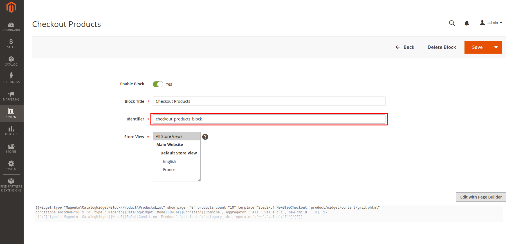
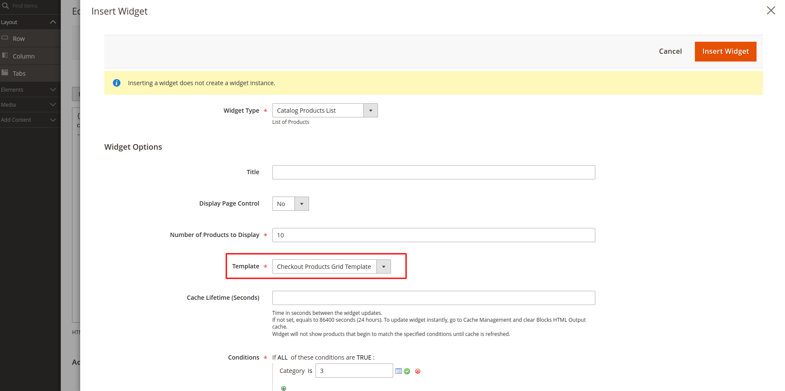

# New Step Checkout

**New Step Checkout contains** 

- Additional checkout step "Checkout Products" before the shipping step with displaying the product list widget.
- Widget that extends Catalog module functionality and provides a template that contains a product list created using rule based filter.

**To use the widget:**
- Create a CMS Block with Identifier "checkout_products_block"

- Insert Product List widget with template option "Checkout Products Grid Template"

